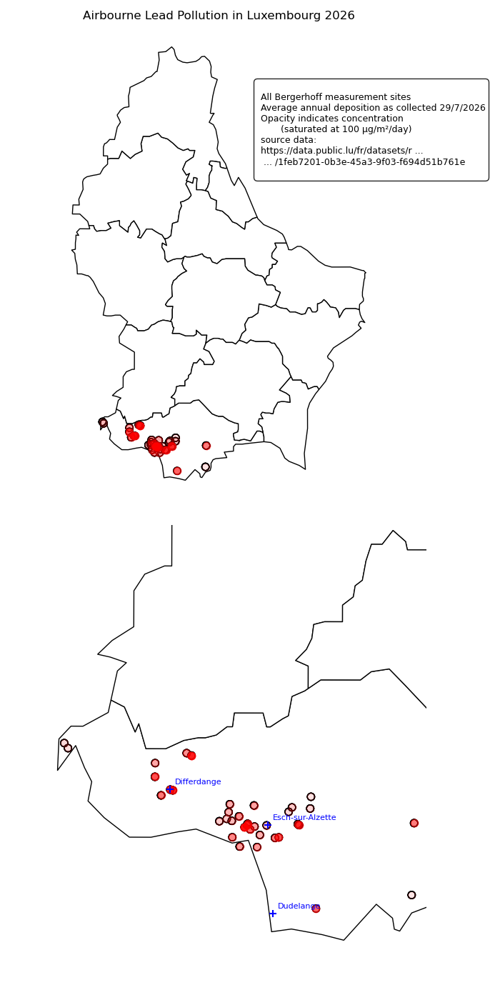

# Environment

Luxembourg is obliged by EU law to carry out quite extensive monitoring of environmental observables, however acting on pollution is primarily at the discretion of the local government. Your role as a citizen is to monitor the data for your commune and complain to the ministry or to the courts when it exceeds acceptable levels.

Data includes:

- Real-time air quality (focus is on dust/smoke and on traffic fumes)
- Airbourne heavy metals (measured per month, only near to likely sources of pollution)
- Noise
- Traffic
- Water quality

## Data Overview

Luxembourg operates a nationwide air-quality monitoring network measuring particulate matter, nitrogen dioxide, ozone and other pollutants. Data are available through the Environment Administration and Luxembourg Open Data. 

**Main Sources**

- [https://data.public.lu/en/datasets/air-quality-telemetric-network](https://data.public.lu/en/datasets/air-quality-telemetric-network)
- [https://environnement.public.lu/fr/loft/air.html](https://data.public.lu/en/datasets/air-quality-telemetric-network)
- [https://aqportal.discomap.eea.europa.eu](https://aqportal.discomap.eea.europa.eu)

---

## Heavy Metals

For parents, lead and other heavy metals are of primary concern: firstly, because these impact a child's health and ability to learn even in small amounts; secondly because Luxembourg's industrial history and ongoing steel recycling do generate substantial heavy metal emissions to the air.

Heavy metal deposition is monitored using the **Bergerhoff network**, which is a standardised process to collect material as it settles from the atmosphere.

Toxic substances monitored include:

- Lead (Pb)
- Cadmium (Cd)
- Arsenic (As)
- Molybdenum (Mo)
- Nickel (Ni)
- Chromium (Cr)
- Zinc (Zn)
- Iron (Fe)

the question of "how much is a problem" can be difficult to answer: for the heavy metals including Lead and Mercury, there is no acceptable exposure. Tolerance to Nickel when inhaled varies dramatically between individuals, it can cause birth defects or miscarriage in susceptible individuals while others may be unaffected. Iron is of course a valuable nutrient when eaten in the correct form, but is toxic when inhaled.

---

## Lead Deposition Map

The map below shows mean lead deposition measured by Bergerhoff stations across Luxembourg.

.

- Marker opacity indicates mass of lead deposited per square metre per day, 100 microgrammes per day is fully opaque.
- Values are averaged from monthly measurements of the given year.

No data is collected for lead outside the industrial / postindustrial areas of concern in the South. High concentrations (above the reference value 100 microgrammes/m2/day) are shown near to the Arcelor Mittal recycling plant in central Differdange, and near to the steel rolling plant in Belval (west of Esch-Sur-Alzette). Significant amounts of lead are present at almost every station, however the amount does decrease with distance from the major sites of concern. A US study has indicated that the harm from exposure to airborne lead drops by roughly half at a distance of 50 miles (80 kilometres) from the source [NBER working paper](https://www.nber.org/system/files/working_papers/w28250/w28250.pdf). Luxembourg is approximately 60 km wide.

Schools which have all or part of their campus within a two km range of a high emission site in 2026 include:

| Institution | Type |
|------------|------|
| Lycée Bel‑Val (LBV) | Secondary school |
| Lycée Guillaume Kroll (LGK) | Secondary school |
| [École Internationale Differdange et Esch-sur-Alzette (EIDE)](schools/eide.ml) | International public school |
| Lycée Mathias Adam (LMA) | Public lycée |
| Lycée Privé Emile Metz (LPEM) | Technical/vocational/general secondary school |

Schools which are less than 100m from a high emission site, such that pollution is visible and likely to have immediate health impacts:

| Institution | Type |
|------------|------|
| [École Internationale Differdange et Esch-sur-Alzette (EIDE)](schools/eide.ml) | International public school |
| Lycée Privé Emile Metz (LPEM) | Technical/vocational/general secondary school |

The script used to plot the above map is available [here](src).

