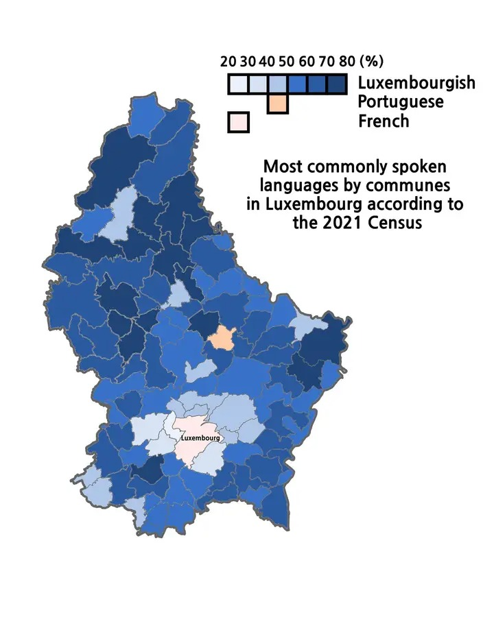

# Languages in Education and Society in Luxembourg

In the mainstream education system the assumption is made that all children will speak both German and the (very similar) Luxembourgish or quickly learn to. French is valuable, however Luxembourgish and German are insisted upon, and parents who do not speak these languages to their child at home are advised to find options for their child to be exposed to them, on their own initiative. The national language teaching service (INLL) does not offer lessons to those under 18. 

Various other options with different language mixes exist, see [types of schools](types_of_schools). The question then arises which language scheme to choose, this difficult question requires you to first ask:
    
- What languages can I support my child in learning? Language teaching succeeds or fails based on the parents.
- What is the quality of the school or school type which offers this programme?
- What opportunities or problems will learning in a given language create?

Note that only the third question is about your child: it is also necessary to be pragmatic about what will work in the child's two most important relationships, with its parents and with the particular caste of people which makes up the teaching profession.

## Language prevalence by commune

.

Above map shows the most common language by commune and the prevalence of it in some sense. This resource comes with no source, unfortunately, but it looks plausible: compare with the map of school promotion rates in the [information section](information). The near-zero rates of school promotion correspond to communes where Luxembourgish is very little spoken (apart from the city, which is complex), while the low or mediocre rates of school promotion correspond to communes where Luxembourgish is the clear majority language. It isn't obvious what decisions parents should make with this information: is it automatically better to live in an area with a few but not many native Luxembourgish speakers, enough to staff the primary school (native-level Luxembourgish is required for mainstream teachers, regardless of what language the children speak) but not so many that they become entitled? The unimpressive rates of promotion in high density Luxembourgish areas may be due to a preference for non-academic life courses in isolated rural communities, and have in fact not much to do with the schools themselves. Ministry officials may argue that the near-zero rates of promotion in Differdange and Larochette are also driven by economic or social factors having nothing to do with the schools, however the high [loss of academic performance](images/billungsbericht_outcomes.png) relative to potential as assessed demographically does argue otherwise. 

## Language use in society

In 2026, a minority of children (about 33%) in Luxembourg spoke Luxembourgish at home as their primary language, however this was the most common single language for children to speak (of more than 100 languages in total) [language survey](https://national-policies.eacea.ec.europa.eu/youthwiki/chapters/luxembourg/61-general-context). 
[The MEN's survey](https://men.public.lu/dam-assets/catalogue-publications/langues/luxembourgeois/brochure-snj-diversite-linguistique.pdf). Geographic distribution of Luxembourgish speakers is very uneven, with high density areas in the North and East of the country.

In the adult world, the majority languages spoken in the workplace are [French, followed by English](https://luxembourg.public.lu/en/work-and-study/employment-in-luxembourg/languages-at-work.html). 

While this contrast between school and the workplace is a consequence of multiple balancing factors, some subject to change, it is not necessarily unsustainable: many children educated in Luxembourgish and speaking Luxembourgish leave the workforce through emigration, while skilled work in Luxembourg is often filled by immigrants. The picture is complicated by per-sector variation in prevalence of languages: French is the primary language of general white collar work, while English is the language of highly skilled or knowledge-driven work, and of international business. Fluent Luxembourgish is often a strong requirement for government employment (including to teach at mainstream schools) and although laws are written in French the legislative body operates verbally in Luxembourgish. 

## Negotiation with the state

Choosing an educational stream is the most important choice that a parent makes for their child, and this choice cannot be made without compromising with the attitude and goals which the education system has.

Parents' goals may be very different depending on background and experience. Those who have enjoyed a high quality education for themselves may have growth of the child's knowledge and abilities as the priority, however it is also quite legitimate that parents should choose to prioritise likely future earning of the child, or to prioritise stability, security, and locality of probable future employment of their child.

### Language preferences for Parents:

- If the child's intellectual development is the priority, then education in English as the vehicular language is the obvious choice. English is the dominant global language of science, scholarship, business, and diplomacy. The German language was once important: the change is marked by Einstein's move to Princeton in 1933. Today the vast majority of PhD theses submitted to German universities are written in English ([Example: TU Berlin](https://depositonce.tu-berlin.de/collections/da16560b-bd8b-4c34-a200-b139f21d9416/search)). While the French language is more structurally protected in French universities, it is still necessary today for French thinkers to write in English in order to maximise their global audience.
  
- For earning power in the private sector, a mixture of languages is definitely advantageous, such that native-equivalent fluency should be targeted for English plus at least one of German and French, and ideally more. Luxembourg's high 7% of unemployment ([in 2026](https://www.luxtimes.lu/luxembourg/unemployment-up/159420547.html)) is at least in part a problem of languages being mismatched to job requirements.

- For stable local employment, a career as a government employee is the obvious preference: learning Luxembourgish in this case is necessary not only to secure a government job but to increase the enjoyment of such a locally-centred life, however parents should be aware that there are not enough government jobs available for all of the young people educated through the Luxembourgish-German mainstream system. Promotion from primary school to the more aspirational academic track is highly dependent on the commune [see billungsbericht map](information) however it is not directly caused by the price of houses: the successful formation of a positive connection between the primary school teacher and the child depends on a match of character and background. The importance of a good feeling from the primary school teacher is higher in Luxembourg than elsewhere: subjective opinions and experiences are specifically included in the child's report (called a 'bilan') and have an effect on outcomes.

We can summarise these three groups of ambitions as "learn" (develop as a human being), "earn" (get a fast route to a job), and "churn" (feed the cycle of people through the luxembourgish language community).

### Language preferences for the Government:

It seems obvious that the Luxembourgish government would promote Luxembourgish, and to a point it does, however the variation in enthusiasm of different schools for different children needs to be understood. Whatever the support and motivation provided by parents, if they and their child are not compatible with the people providing the education then this will be of no benefit and the child will be rejected by the system ([see billungsbericht graph](information)). It is important to be aware of the disconnect between stated goals of the government, to expand the Luxembourgish-speaking community, and the actual behaviour of government institutions and employees.

School teachers will strenuously deny any prejudice or hostility to immigrants or the children of immigrants, therefore the low rate of realisation of the potential of immigrant children in the mainstream system may in part be due to inadequate language learning or acculturation opportunities outside the school system, which operates for only approximately 30 hours per week therefore leaves plenty of time in theory for language learning. Currently this excess time (the approximately ten hour difference between the school week and a working week) is taken care of either by a stay-at home parent or by informal childcare organisations (with a state subsidy) called 'maisons relais'. Schools which suffer from [staffing problems](https://today.rtl.lu/news/luxembourg/luxembourg-schools-face-numerous-challenges-mps-agree-224537391) will occupy part of the school week with semi-supervised 'nothing lessons' in which an unqualified adult is typically present but does not teach. In any case, if lack of language skills is genuinely the obstacle to realisation of children's potential in the mainstream system then this large dead time, itself often very stressful for the children, represents a missed opportunity to remedy that. 

The Luxembourgish government is not intolerant of those who aim to develop immigrant children to higher levels of educational attainment by going in parallel to the mainstream system however the flow of resources indicates that this is not a priority: places for the 'fully international' [international GCSE](types_of_schools) are massively oversubscribed. The [types of schools](types_of_schools) section discusses further options including cross-border or fee-paying education.

## Luxembourgish and German

German's assumption of fourth position in the list of Luxembourg's most economically relevant languages creates a challenge to the model of the mainstream primary school system. In the default model, children begin in Luxembourgish and convert smoothly to German, as the 'minimum language' for accessing technical education or economic opportunities as adults; French and English are then learned as more advanced and potentially optional language subjects. The education ministry is adapting to this incrementally, with the introduction of 'project alpha' primary schools currently (in September 2026) offer children the opportunity to learn the alphabet either in French or German variants of the letters (e.g. 'Y' as 'igrek' or as 'Ypsilon'). The early reporting on the effect of this subtle but potentially important shift was [contentious enough](https://www.reporter.lu/fr/luxembourg-education-fondamentale-projet-alpha-quand-les-faits-deplaisent-a-la-politique/) that it cannot immediately be greeted as a success.

### Tradition of convenient higher education in Germany

Defenders of the Luxembourgish-to-German pipeline argue that German is '80% for free' assuming that one is already committed to Luxembourgish, and further that while French and English may be currently dominant economic languages, higher education in Germany is not bad, and may be in a soft sense more open to Luxemburgers than studying elsewhere. In practice there are excellent options for study at low or zero fees in all three of the neighbouring countries, and at the [University of Luxembourg](uni.lu) itself, as well as further afield in Europe and Switzerland. For those who want the prestige of paying a high fee, the UK and US certainly offer this possibility. Currently Germany does remain the leading [destination for study](https://eurydice.eacea.ec.europa.eu/eurypedia/luxembourg/mobility-higher-education) however Luxembourg is in second place, and France and Belgium are close followers such that together they take more students than Germany does.

